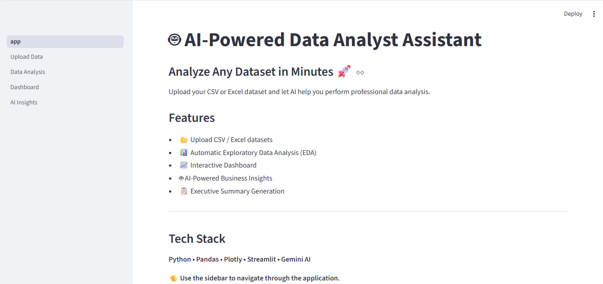
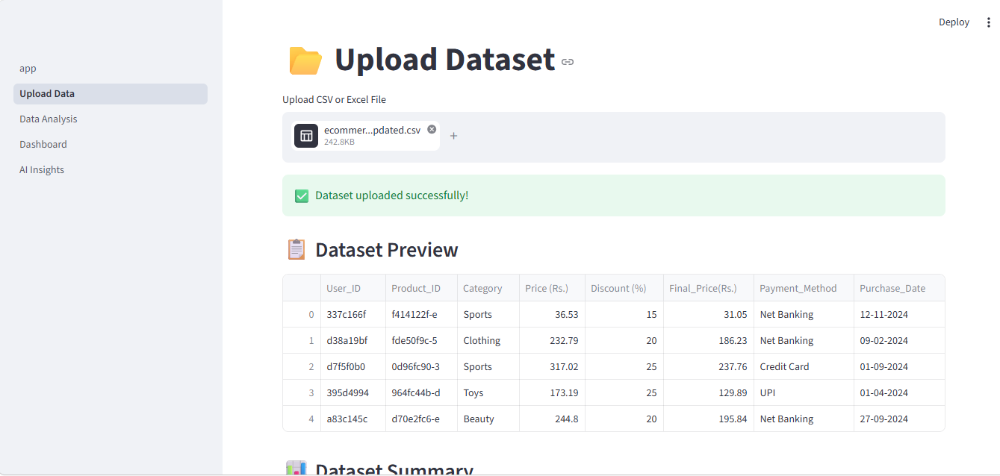
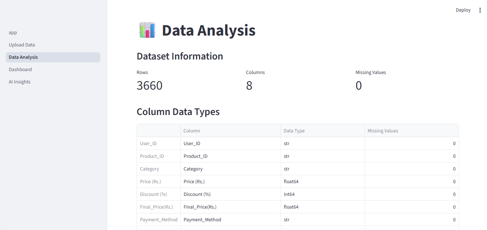
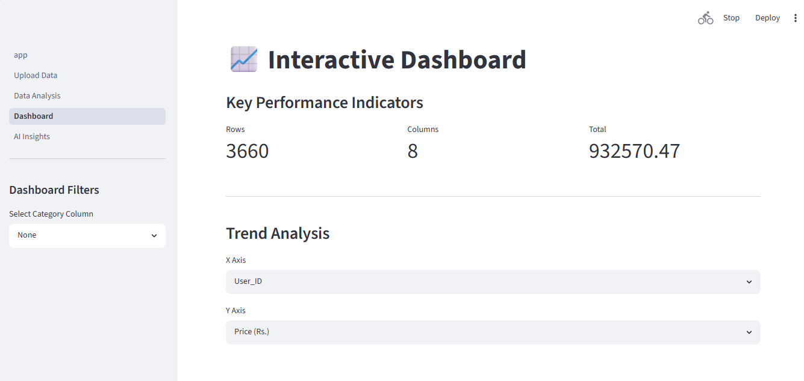
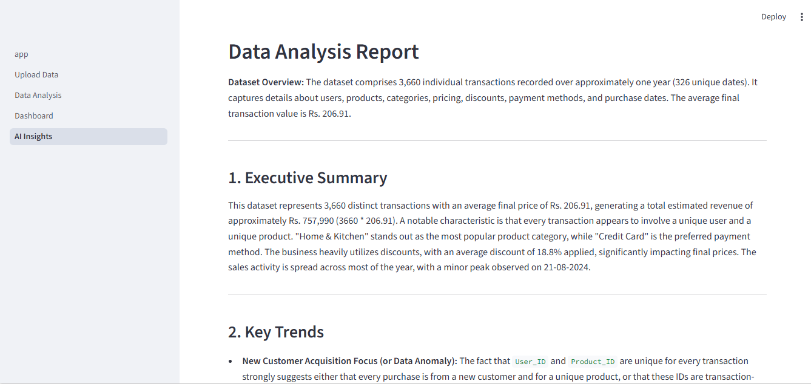

# 🚀 DataPilot — AI-Powered Data Analytics Platform

DataPilot is an intelligent data analytics platform that automates the complete analytics workflow—from raw dataset ingestion to data profiling, cleaning, interactive dashboards, and AI-generated business insights.

Designed for data analysts, business analysts, and data scientists, the platform enables users to transform raw CSV or Excel files into actionable insights with minimal manual effort.

---

## ✨ Key Features

### 📂 Dataset Upload
- Upload CSV and Excel datasets
- Automatic schema detection
- Shared dataset across all application modules

---

### 🧹 Data Cleaning Studio

A complete interactive data preprocessing environment.

Features include:

- Remove duplicate records
- Drop unwanted columns
- Handle missing values
  - Mean
  - Median
  - Mode
  - Custom values
  - Remove incomplete rows
- Standardize dataset
- Export cleaned dataset as CSV

---

### 📊 Automated Data Profiling

Automatically generates a comprehensive data quality report.

Includes:

- Column type detection
- Missing value analysis
- Unique value statistics
- Cardinality detection
- Numeric statistics
  - Mean
  - Median
  - Standard deviation
  - Skewness
- Outlier detection (IQR)
- Correlation analysis
- Duplicate detection
- ID column detection
- Data quality warnings
- Plain-language dataset summary

---

### 📈 Interactive Dashboard

Create business dashboards instantly.

Supports:

- Dynamic filtering
- KPI cards
- Trend analysis
- Bar charts
- Line charts
- Scatter plots
- Box plots
- Correlation heatmaps
- Drill-down analysis

---

### 🤖 AI Business Insights

Powered by **Groq Llama 3.3-70B**.

Generates:

- Executive Summary
- Key Business Trends
- Risks
- Opportunities
- Strategic Recommendations

The AI uses the computed EDA profile to generate context-aware insights instead of relying solely on raw data.

---

## 📸 Application Preview

### Home



---

### Upload Dataset



---

### Data Profiling



---

### Interactive Dashboard



---

### AI Insights



---

## 🏗️ Architecture

```
                 CSV / Excel
                      │
                      ▼
              Dataset Upload
                      │
                      ▼
              Data Cleaning
                      │
                      ▼
            Automated Profiling
                      │
        ┌─────────────┴─────────────┐
        ▼                           ▼
 Interactive Dashboard      AI Insights
        │                           │
        └─────────────┬─────────────┘
                      ▼
             Business Decisions
```

---

## 🛠️ Technology Stack

### Languages

- Python

### Framework

- Streamlit

### Data Processing

- Pandas
- NumPy

### Visualization

- Plotly
- Matplotlib

### AI

- Groq API
- Llama 3.3 70B Versatile

### File Processing

- OpenPyXL

---

## 📁 Project Structure

```
DataPilot
│
├── app.py
├── requirements.txt
├── README.md
├── .gitignore
│
├── pages
│   ├── Upload_Data.py
│   ├── Data_Analysis.py
│   ├── Dashboard.py
│   ├── AI_Insights.py
│   └── Data_Cleaning.py
│
├── utils
│   ├── data_profiler.py
│   ├── dashboard_helpers.py
│   └── ui.py
│
├── assets
│
└── datasets
```

---

## ⚙️ Installation

Clone the repository

```bash
git clone https://github.com/YOUR_USERNAME/DataPilot.git
```

Move into the project

```bash
cd DataPilot
```

Create a virtual environment

```bash
python -m venv venv
```

Activate it

Windows

```bash
venv\Scripts\activate
```

Linux / macOS

```bash
source venv/bin/activate
```

Install dependencies

```bash
pip install -r requirements.txt
```

---

## ▶️ Run

```bash
streamlit run app.py
```

---

## 🌐 Deployment

Deploy directly using **Streamlit Community Cloud**.

1. Push repository to GitHub
2. Connect repository
3. Select `app.py`
4. Add your Groq API key under **Secrets**
5. Deploy

---

## 📊 Supported Dataset Types

The application supports any structured dataset including:

- Sales
- Retail
- Banking
- HR
- Healthcare
- Marketing
- Finance
- E-commerce
- Supply Chain

---

## 💡 Future Roadmap

- PDF report generation
- SQL database connectivity
- Multi-file analysis
- AutoML integration
- Time-series forecasting
- Natural language querying
- Role-based authentication
- Cloud storage integration

---

## 👨‍💻 Author

**Akshad Gajapure**

B.Tech, National Institute of Technology Raipur

**Areas of Interest**

- Data Analytics
- Data Science
- Business Intelligence
- Machine Learning
- AI Applications

---

## ⭐ Support

If you found this project useful, consider giving it a ⭐ on GitHub.
